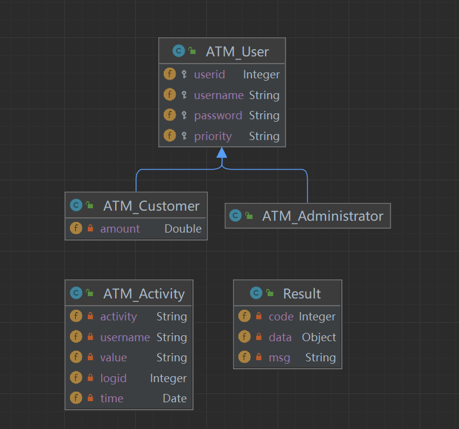

基本实体类图

所有请求的返回值皆为Result, Result中有三个值  
code: 状态码    200=成功 400=失败 
msg: 状态信息   null=成功 非空=失败 
data: 数据       又返回数据的已用"return:"标出 
 
 
用户: 
    1.登陆 
    url: /ATM/login (post) 
    param: username, password 
    return: User对象，其中的priority值为"admin"时表示管理员， 值为"cust"时表示顾客 
 
顾客: 
    1.提款 
    url: /ATM/drow (post) 
    param: count (金额) 
    2.存款 
    url: /ATM/save (post) 
    param: count(金额) 
    3.查询余额 
    url: /ATM/get (get) 
    param: null 
    return: Double,值表示余额 
 
管理员: 
    1.显示所有用户 
    url: /ATM/admin/users 
    param: null 
    return: User数组, 当前系统中的所有用户(不包括管理员) 

[//]: # (    2.显示当前用户的活动 )

[//]: # (    url: /ATM/admin/activity )

[//]: # (    param: username )

[//]: # (    return: Activity集合, 该用户的所有活动记录 )

    
    

